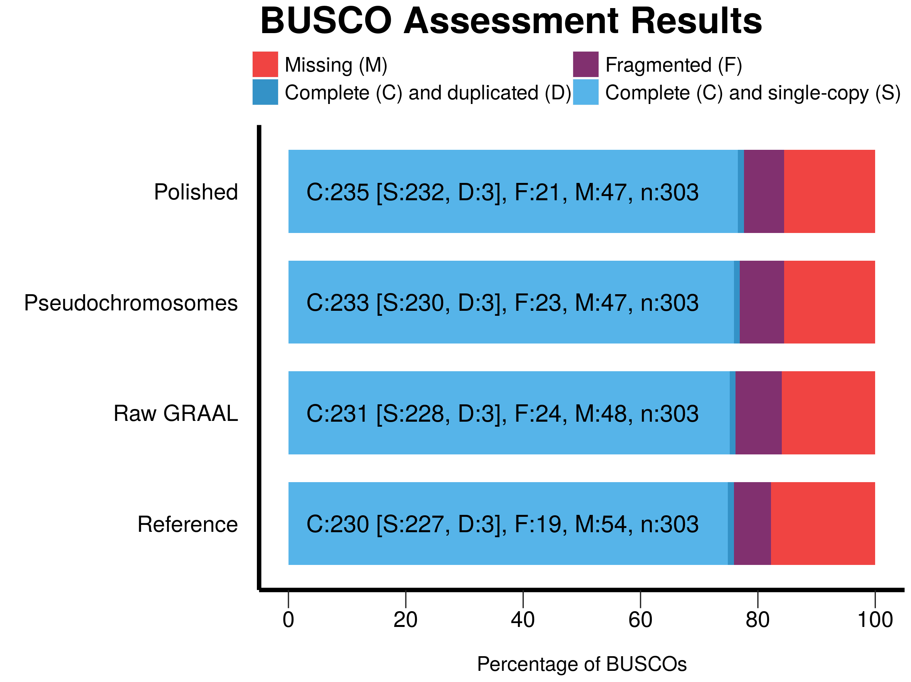

# *Ectocarpus sp*. scaffolding project


This repo contains instructions on how to reproduce the main results and figures of our [instaGRAAL](https://github.com/koszullab/instaGRAAL) showcase paper on the Hi-C based scaffolding of the *Ectocarpus sp.* genome. Since we realize some of the steps can take time to run, we also provide intermediate data (such as the initial contact maps).

## Getting the data

Our data (genomes, maps, etc.) can be cloned from this repository:

```sh
    git clone https://github.com/baudrly/ectocarpus_scripts
    cd ectocarpus_scripts
```

Hi-C reads for *Ectocarpus sp.* can be retrieved from the Sequence Read Archive (SRA) with the following accession number: SRR8550777

```sh
    fastq-dump -Z SRR8550777
```

## Generating contact maps for the reference genome

There are many available Hi-C pipelines out there; in order to generate a contact map that's compatible with our scaffolder, we recommend using [HiC-Box](https://github.com/koszullab/HiC-box) (for a graphical interface) or [hicstuff](https://github.com/koszullab/hicstuff) (for a command-line interface). The ```hicstuff``` pipeline acts as a Python library and can be directly installed from PyPI with the following command:

```sh
    pip3 install hicstuff
```

The following ```hicstuff``` command should generate the contact map from the reads with the parameters used in the paper:

```sh
    hicstuff pipeline --enzyme DpnII --outdir ectocarpus_map --threads 8 *end* --fasta data/genomes/ecto_sp_reference_genome.fa -T tmp --quality_min 30
```

(The ```HiC-Box``` GUI can be directly downloaded and run from the repo but dependencies should be installed manually. Parameters in the interface are identical to the ones in ```hicstuff```)

Once the pipeline is done, you may view the contact map by running the following command:

```sh
    hicstuff view ectocarpus_map/abs_fragments_contacts_weighted.txt --binning 5
```

Adjust the ```binning``` value to visualize the initial map at different resolutions (be aware that very large resolutions may hog your computer's memory).

A pre-loaded map are also available at ```data/initial_map```. You may copy it over to ```ectocarpus_map``` to proceed with the scaffolding.

## Running the scaffolder

Instructions for installing the instaGRAAL scaffolder can be found on the [repo](https://github.com/koszullab/instaGRAAL)'s README. Once you are done, it may be run with the following command:

```sh
    instagraal ectocarpus_map data/genomes/ecto_sp_reference_genome.fa instagraal_output --level 4 --cycles 200 --coverage-std 1 --bomb --save-matrix
```

Likewise, detailed information on the parameters may be found on the README, but to summarize:

* ```level``` indicates the resolution at which sequences are going to be moved: level 0 indicates the restriction fragments themselves, level 1 indicates bins of 3 RFs, level 2 means 9 RFs and so on. The higher, the faster (and less resolutive).
* ```cycles``` indicates how many times each fragment (or bin) is going to be sampled for operations ('mutations'). The higher, the longer the computation.
* ```coverage-std``` indicates the portion of fragments that are going to be filtered out due to low coverage. It is a lower bound on the coverage (in standard deviations below the mean), below which fragments are discarded (they are to be reintegrated later during the polishing step).
* ```bomb``` indicates whether to explode the initial scaffolding.
* ```save-matrix``` will save a (relatively low-res) snapshot of the contact map after each cycle to indicate the scaffolder's progression.

The scaffolder will generate a fresh new genome after each cycle, found in ```instagraal_output/test_mcmc_4/genome.fasta```. Information about the make-up of each scaffold in the genome can be found at ```instagraal_output/test_mcmc_4/info_frags.txt```, as well as the evolution of the model's parameters.

Figures for the evolutions of parameters and the scaffold size distribution can be generated by running the ```generate_figures.py``` script as is. Loading everything at once may take some time, so the script has been decomposed into three functions in case you want to execute them one by one.

In any case, an already scaffolded assembly (and associated ```info_frags.txt```) is available at ```data/genomes/ecto_sp_raw_graal.fa``` should you wish to directly proceed with the polishing.

## Polishing the genome

By 'polishing', we designate a way of reconstructing the initial structures of the original contigs within each newly formed scaffold. This may or may not be desirable depending on how much one trusts the initial assembly, so the library has been decomposed into many options. In the case of *Ectocarpus sp.*, we ran all of them at once:

```sh
    instagraal-polish -m polishing -i instagraal_output/test_mcmc_4/info_frags.txt -f data/genomes/ecto_sp_reference_genome.fa -o data/genomes/ecto_sp_polished_assembly.fa
```

The new ```info_frags.txt``` for the polished genome is aptly named ```new_info_frags.txt```.

A pre-polished assembly is available at ```data/genomes/ecto_sp_polished_assembly.fa``` should you wish to directly proceed with the validation. (The above polishing command will overwrite it by default.)

## Validating the genome

In order to get main stats from [LG-QUAST](https://github.com/ablabl/quast), install it and run the following:

```sh
    quast.py -R data/genomes/ecto_sp_reference_genome.fa --eukaryote --fragmented --features data/annotations/EctsiV2_all.gff3 --plots-format svg --no-gzip -o ectocarpus_quast --threads 8 --min-identity 99.9 --large --labels "Pseudochromosomes,GRAAL,Polished" data/genomes/ecto_sp_pseudochromosomal_assembly.fa data/genomes/ecto_sp_raw_graal_assembly.fa data/genomes/ecto_sp_polished_assembly.fa --k-mer-stats
```

and from BUSCO (replacing paths accordingly):

```sh
for genome in data/genomes/*.fa; do python /path/to/run_BUSCO.py -i $genome -o $(basename ${genome%.fa}) -l /path/to/eukaryota_odb9 -m genome -c 8 --long; done
```

Putting together the results (with the help of BUSCO's ```generate_plots.py```) should show something like this



## Generating post-scaffolding contact maps

In order to generate new hi-res contact maps, we recommend re-running the hicstuff pipeline on the newly scaffolded genome:

```sh
    hicstuff pipeline --enzyme DpnII --outdir ectocarpus_polished_map --threads 8 *end* --fasta data/genomes/ecto_sp_polished_assembly.fa -T tmp --quality_min 30
```

The resulting maps can be viewed like above:

```sh
    hicstuff view ectocarpus_polished_map/abs_fragments_contacts_weighted.txt --binning 5
```